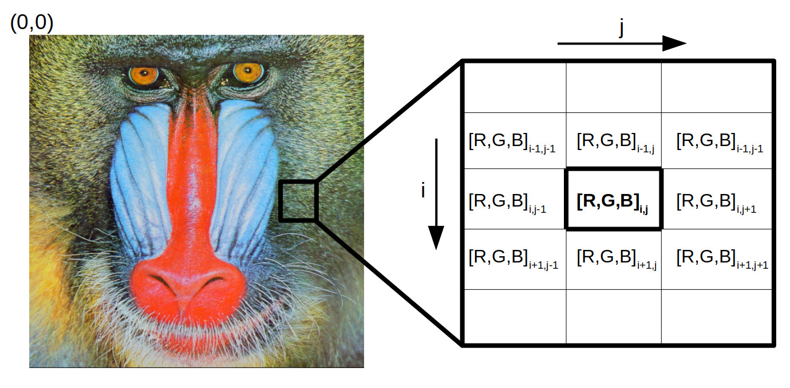
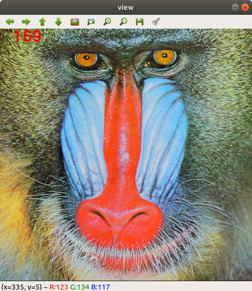
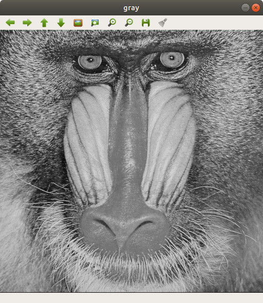
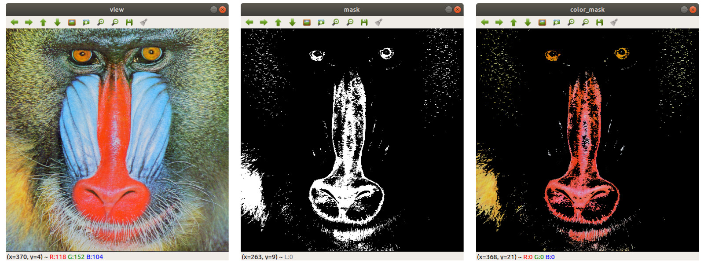
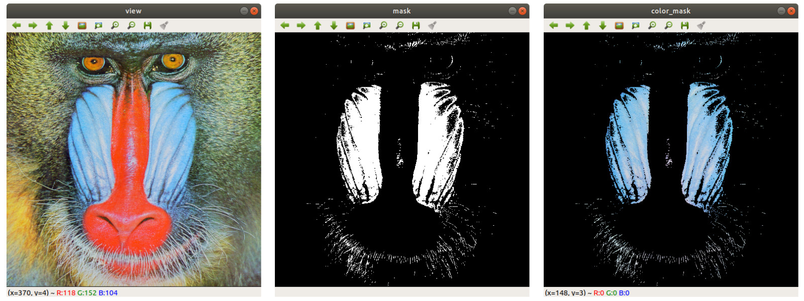
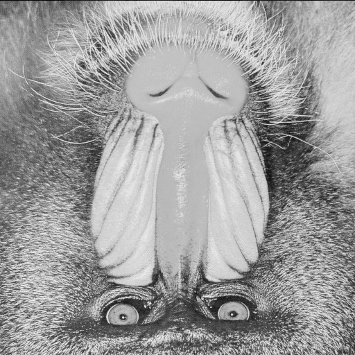

# RGB Image Processing with OpenCV and ROS

The goal of this repository is to introduce students to RGB image processing using OpenCV and ROS.

# 0. Get the introduction to robot vision libraries

## 0.1 Clone this repository

**Warning:** *You only need to do this once. If you have already created this repository in your local machine, pulling it again may cause a lost of your information.*

First, create a workspace:

```
cd ~
mkdir -p tidbots_ws/src
cd tidbots_ws
catkin_make
```

Then, clone this repository into the src folder:

```
cd ~/tidbots_ws/src
git https://gitlab.com/tidbots/robointro.git
cd ..
catkin_make
```

# 1. Getting to know your image

Before starting manipulating images, we should undertand what are they and how we can access their data. In this work, we understand the images as a 2D array, or matrix, where each element (also known as **pixel**) in the array has a color value. We use three color channels per element in the array: Red, Green, and Blue. The origin of this image matrix is at the top-left corner and columns values increase positively from left to right while rows values increase positively from top to bottom, as can be seen in the image bellow:

<p align="center">
  
</p>

Each color channel has an integer value between 0 and 255. For example, a value of RGB = [255, 0, 0] represents the red color because the value red = 255 is the maximum possible while the green = 0 and blue = 0 values represent the absence of those color. Similarly, RGB = [0, 255, 0] represents the green color and RGB = [0, 0, 255] represents the blue color. The combination of these three channels with different intencities give us our perception of true color (for example, if you combine different values of red and green you will obtain a range of tonalities of yellow, e.g. RGB = [128, 128, 0]).

# 2. Basic operations

From our previous tutorial, we learnt how to subscribe to a ROS Image topic

```
ros::NodeHandle nh;
image_transport::ImageTransport it(nh);
image_transport::Subscriber sub = it.subscribe("camera/image", 1, callback_image);
```

and to transform our ROS Image message to an OpenCV matrix array:

```
cv::Mat img;
img = cv_bridge::toCvShare(msg, "bgr8")->image.clone();
```

## 2.1 Image dimensions

### C++

Have a look at the `my_processing.cpp` file. Let's inspect our image. First, les's see the dimensions of out image (we add a `counter` index so we print get these values only in the first iteration):

```
if (counter == 0)
	std::cout << "img size: rows: " << img.rows << ", cols: " << img.cols << ", depth: " << img.channels() << std::endl;
```

Let's test our code. First, we need to compile our code:

```
cd ~/tidbots_ws
catkin_make
```

Now, as in our previous examples, run the following command:

```
roscore
```

And, in a different terminal, run:

```
source ~/tidbots_ws/devel/setup.bash
rosrun introvision_images my_publisher ~/tidbots_ws/src/robointro/1_images/data/baboon.png
```

Finally, in a new terminal, run this command:

```
source ~/tidbots_ws/devel/setup.bash
rosrun introvision_processing my_processing
```

where we should be able to see information regarding to our image.

### Python

Have a look at the `my_processing.py` file. Similarly, we first determine the dimensions of our image. In contrast to C++, in Python our `shape` operator in our matrices returns three values (the number of rows, columns and channels) for color images and two values (rows and columns) for grayscale images. So you can use the length of this vector to determine if your image is a multi- or single-channel array.

```
if (counter == 0):
	(rows,cols,channels) = img.shape
	print ('img size: rows: {}, cols: {}, channels: {}'.format(rows, cols, channels))
	print ('length (img_gray): {}'.format(len(img_gray.shape)))
```

Now, let's try our code. Unlike C++, we don't need to compile our code in Python. So, run the following command:

```
roscore
```

In a different terminal, run:

```
source ~/tidbots_ws/devel/setup.bash
rosrun introvision_images my_publisher ~/tidbots_ws/src/robointro/1_images/data/baboon.png
```

Finally, in a new terminal:

```
source ~/tidbots_ws/devel/setup.bash
rosrun introvision_processing my_processing.py
```

where we should be able to see information regarding to our image.

### Homework 2.1

* What is the size (columns, rows, and channels) of our image?

## 2.2 Image manipulation

To understand how to manipulate our images, let's first make some easy edits. In this case, we will add an increasing id number to our image. Remember that the top-left corner is our image origin (0,0), and that the columns increase from left to right and the rows from top to bottom. 

### C++

To add a text into our image `img`, we use the OpenCV function `cv::putText`. We have an integer `counter` variable that we increase each time we receive and process a new image, and we transform it into a text sequence using the `std::to_string(counter)` function.

To understand how an image is coded in OpenCV, play around with the `cv::Point` and `CV_RGB` values. The cv::Point(col_id, row_id) marks the origin of our text (i.e. the bottom-left corner of our text box); use different values of col_id and row_id and see what happens.

On the other hand, the CV_RGB(red, green, blue) parameter determines the our text's color. Remember that a single color channel ranges from 0 to 255, so try different red, green, and blue combinations and see all the colors you can create!

```
cv::putText(img,
	std::to_string(counter),
	cv::Point(25, 25), //change these values cv::Point(col_id, row_id)
	cv::FONT_HERSHEY_DUPLEX,
	1.0,
	CV_RGB(255, 0, 0), //change these values CV_RGB(red, green, blue)
	2);
```

Compile and test your code as in the previous section.

### Python

Likewise, we use the `cv2.putText` function to add a text string into our `img` array. The two dimensional vector (col_id, row_id) marks the origin (bottom-left) of our text box. The three dimensional vector indicates our text's color. However, in Python **the order of our color channels is (blue, green, red)**. Be aware of this difference when you work with C++ and Python at the same time. Now, give different values to the color vector and see how the behave.

```
cv2.putText(img, 
	str(counter),
	(25,25), 
	cv2.FONT_HERSHEY_SIMPLEX, 
	1, 
	(255, 0, 0), 
	2, 
	cv2.LINE_AA)
```

Again, try your code as in the previous section.

You should see something like

<p align="center">
  
</p>

### Homework 2.2

* Provide the output image for five different text positions and color combinations.

## 2.3 Image transformations

## 2.3.1 BGR to Grayscale

Now that we have an idea of the compostition of an image and some understandig of our code, let's add some image transformations. We will show you how to apply one of the built-in functions in OpenCV, so you can explore all the available functions depending on your task at hand.

Let's change our image from color to grayscale. We can understand a gray scale as a color image where the `Gray` value is a combination of the different color channels as follows:

&plus;(0.59*G)&plus;(0.11*B)))

and it has the same value in its three channels, i.e. RGB = [Gray, Gray, Gray]. Therefore, to reduce the memory used, many systems only uses a one channel matrix with a single Gray value per pixel: RGB = [Gray]. 

### C++

Please complete the provided code with the following instructions as appropiated. We first create a new matrix `img_gray` and apply the OpenCV `cvtColor` function to our original `img` image:

```
cv::Mat img_gray;
cv::cvtColor(img, img_gray, CV_BGR2GRAY);
```

Let's inspect our image:

```
if (counter == 0)
	std::cout << "img_gray size: rows: " << img_gray.rows << ", cols: " << img_gray.cols << ", depth: " << img_gray.channels() << std::endl;
```

and display it in a new window:

```
cv::imshow("gray", img_gray);
```
Compile and test your code as in the previous sections.

### Python

Similarly, we apply our `cvtColor` function to our original `img` and store it in a new `img_gray` array.

```
img_gray = cv2.cvtColor(img, cv2.COLOR_BGR2GRAY)
```

Then, we inspect our image. Remember that our `shape` operator returns three values for color images and two valuesfor grayscale images and that you can use the length of this vector to determine if your image is a multi- or single-channel array.

```
if (counter == 0):
	(rows,cols) = img_gray.shape
	print ('img_gray size: rows: {}, cols: {}'.format(rows, cols))
	print ('length (img_gray): {}'.format(len(img_gray.shape)))
```

and show it:

```
cv2.imshow("gray", img_gray)
```

Now, save your files and test them as before. What can you see? Did you notice how a grayscale image uses only a single channel to represent all the information instead of three channels with the same values.

Again, try your code as in the previous section.

The expected output is

<p align="center">
  
</p>

### Homework 2.3.1

* What is the size (columns, rows, and channels) of our grayscale image? Show the resulting image. 

## 2.3.2 Color Thresholding

Now we will create a very basic color segmentator. For simplicity, we will use the BGR color space, but it is more common to use the HSV color space; we let the interested reader to find what are the extra steps to use a HSV image for color segmentation.

An easy way to create a color segmentator is to find ol the pixels that are around our target color. For example, if we want a to segment a high intensity red color, for example, with a red channel value around `my_red=[225]`, we find all the pixels in the range (my_red-delta , my_red+delta) where `delta` is a value that we define; it is important to note that, in this example, the other channels range from 0 to 255.

Therefore, we have two steps to create a segmented image, first we find the pixels inside our desired range and mark as them as ONE and all the pixels outside the range as ZERO, we call this array with ZEROs and ONEs a **mask**. Then, we create an output image where all the elements in the MASK have a color value from the input image and all other pixels are zero (or black).

### C++

First, we create our mask image and fill it with zeros and ones, depending whether the pixel is inside or outside our color range (**remember the order in our array: [Blue,Green,Red]**), respectively:

```
cv::Mat mask;
cv::inRange(img, cv::Scalar(0,0,220), cv::Scalar(240,255,240), mask);
```
In the example, our target color is `red=255`, and `delta=20`, the blue and green channels vary from 0 to 255. Then, we copy only those pixels that met our range condition. We use the `img.copyTo(output,mask)` to copy to our *output* image only those pixels with a ONE in our *mask*:

```
cv::Mat color_mask;
img.copyTo(color_mask, mask);
```
Finally, don't forget to show your images

```
cv::imshow("mask", mask);
cv::imshow("color_mask", color_mask);
```

Compile and test your code as in the previous sections.

A segmented image in the red channel should look like

<p align="center">
  
</p>

### Python

Here, we define the valid color range we want to use (**remember the order in our array: [Blue,Green,Red]**). Now, we will select a blue color, so `blue=220` and `delta=10`, the red and green channel vary from 0 to 255, as follow:

```
lower_val = np.array([200,0,0])
upper_val = np.array([240,255,255])
```

Then, we create our mask with ONE values whenever a pixel is in that color range, we using the `cv2.inRange` function:

```
mask = cv2.inRange(img, lower_val, upper_val)
```

Finally, we copy those pixels from our original to our segmented image as follows:

```
color_mask = cv2.bitwise_and(img,img, mask= mask)
```

Now, we show our result:

```
cv2.imshow("mask", mask)
cv2.imshow("color_mask", color_mask)
```

Again, try your code as in the previous section.


A segmented image in the blue channel should look like

<p align="center">
  
</p>

### Homework 2.3.2

* Create five segmented images using different color ranges. From the previous unit, do you remember how to start an image publisher using you camera? Try using it and place objects with different colors in front of your camera and see what happens!

# 3. Per-element operations

Although OpenCV comes with a variety of functions, we well alway need to access to the elements of our matrix for a number of reasons (from simple inspection to the implementation of our own algorithms). Here, we will provide a simple way to access all the elements in your array.

## 3.1 Single element access

Let's first inspect one pixel value of our array at a given (row_id, col_id) position. **Remember that our array starts in `(0,0)` and therefore the last element in our image `img` (at the bottom-rigth corner) is `(img.rows - 1, img.cols - 1)`**. 

### C++

We use the `img.at<cv::Vec3b>(row_id,col_id)` attribute in our `img` matrix to get a color element in the [Blue,Green,Red] order, and `img.at<uchar>(row_id,col_id)` to get a grayscale value -- if you don't know what is a `uchar` data type, please review that concept; in short, it is an integer that goes from 0 to 255. **Notice the id input order in our function, the first index ALWAY correspond to the rows and the second index to the columns**; be careful with the elements' order when you use OpenCV functions, as an example, remember that in our `cv::putText` function the `cv::Point` element has a (col_id, row_id) order while the `at<>` attribute of our image has a (row_id,col_id) order. 

In this case, we will inspect the middle point in our array as follows:

```
if (counter == 0)
{
	int row_id, col_id;
	row_id = img.rows/2;
	col_id = img.cols/2;

	std::cout << "pixel value in img at row=" << row_id << ", col=" << col_id << " is: " << img.at<cv::Vec3b>(row_id,col_id) << std::endl;
	std::cout << "pixel value in img_gray at row=" << row_id << ", col=" << col_id << " is: " << (int)img_gray.at<uchar>(row_id,col_id) << std::endl;
}
```

Compile and test your code as in the previous sections.

**Important: You should notice that, for color images, the output of the `img.at<cv::Vec3b>(row_id,col_id)` operator is a 3D vector with the [Blue,Green,Red] information, in that order.** 

### Python

Here, we access to the elements in our `img` array as in any other Python array: `img[row_id,col_id]` to get a color pixel in [Blue,Green,Red] order or a grayvalue scalar. **We ALWAYS indicate the rows first and then the columns**; again, be careful with the input order when you use different OpenCV functions in Python. Then, we get the values of our middle pixel element as:

```
if (counter == 0):
	(rows,cols,channels) = img.shape
	row_id = rows/2
	col_id = cols/2

	print ('pixel value in img at row: {} and col: {} is {}'.format(row_id, col_id, img[row_id,col_id]))
	print ('pixel value in img_gray at row: {} and col: {} is {}'.format(row_id, col_id, img_gray[row_id,col_id]))
```

Again, try your code as in the previous section.

**IMPORTANT: You should notice that, for color images, the output of the `img[row_id,col_id]` operator is a 3D vector with the [Blue,Green,Red] information, in that order.** 

### Homework 3.1 

* Provide the values of ten different pixels in your image.

Do you remember the equation to obtain the Gray value from a combination of the different color channels? Does it apply to your image?


## 3.2 Multi element access

Now that we know how to access an element in our image and the kind of information in it (color or grayscale), let's access all our pixels consistenly. Remember that the Gray value is a combination of the three different color channels in an image. A commom function that approximates the gray value is as follows:

&plus;(0.59*G)&plus;(0.11*B))) 

so let's apply that equation to all and every pixel in our image. To do so, we need to run a *nested foor loop* where one index goes from the first to the last column and the other index goes from the fisrt row to the last. Remember that, in general, **the array indices start in zero and, therefore, they should end at (width-1) and (height-1)**.

### C++

First, we need to create a single channel matrix to store our new image, so it should have the same dimensions as our input and each value should be `uchar`:

```
cv::Mat img_gray_2 = cv::Mat::zeros(img.rows,img.cols, CV_8UC1);
```

Then, we create our indices to access all the elements in our image. Please, remember which index correspond to the rows and what to the columns! In our case, the `i` variable correspond to the rows and the `j` index to the columns:

```
for(int i=0; i(row_id,col_id)` operator; remember that this operator's output is a [Blue,Green,Red] vector so, we have:

```
int gray_val = 0.11*img.at<cv::Vec3b>(i,j)[0] + 0.59*img.at<cv::Vec3b>(i,j)[1] + 0.3*img.at<cv::Vec3b>(i,j)[2];
```

We store the `int` gray value in our `uchar` new `uchar` matrix at the (i,j) position:

```
img_gray_2.at<uchar>(i,j) = (unsigned char)gray_val;
```

Your code should look something like:

```
cv::Mat img_gray_2 = cv::Mat::zeros(img.rows,img.cols, CV_8UC1);
for(int i=0; i(i,j)[0] + 0.59*img.at<cv::Vec3b>(i,j)[1] + 0.3*img.at<cv::Vec3b>(i,j)[2];
		img_gray_2.at<uchar>(i,j) = (unsigned char)gray_val;
	}
```

Finally, don't forget to display your image (each new window should have its unique name):

```
cv::imshow("gray_2", img_gray_2);
```

Compile and test your code as in the previous sections.

### Python

Similarly, we start by defining our new `uint8` matrix (the `uint8` data type in Python is similar to the `uchar` data type in C++):

```
(rows,cols,channels) = img.shape
img_gray_2 = np.zeros( (rows,cols,1), np.uint8 )
```

Then, we create our indices (please refer to the manual to know how the `range(int)` function works; basically, it creates a sequence of numbers from 0 to int-1), remember which index correspond to the rows and the columns:

```
for i in range(rows):
	for j in range(cols):
```

Then, access to the information for pixel (i,j), combine it to create a grayscale value, and store it in our new grayscale image:

```
for i in range(rows):
	for j in range(cols):
```

Your code should look like:

```
(rows,cols,channels) = img.shape
img_gray_2 = np.zeros( (rows,cols,1), np.uint8 )

for i in range(rows):
	for j in range(cols):
		p = img[i,j]
		img_gray_2[i,j] = int( int(0.11*p[0]) + 0.59*int(p[1]) + int(0.3*p[2]) )
```

Finally, don't forget to show your new image:

```
cv2.imshow("gray_2", img_gray_2)
```

Again, try your code as in the previous section.

**IMPORTANT: Can you notice the difference in velocity!? Although C++ seems more cumbersome thant Python, the execution speed is much more faster. A common practice is to use C++ for the core operations in our applications and Python for the high level processes.**

### Homework 3.2

* Create a loop to access all the elements in your gray image and rotate it 180 degrees. The result should be as in the image bellow.

<p align="center">
  
</p>

**Hint** You should create a new matrix before starting your loop. Also, be observe the indices in your original and in your new image. what is their relationship?

## Authors

* **Luis Contreras** - [AIBot](http://aibot.jp/)
* **Hiroyuki Okada** - [AIBot](http://aibot.jp/)

