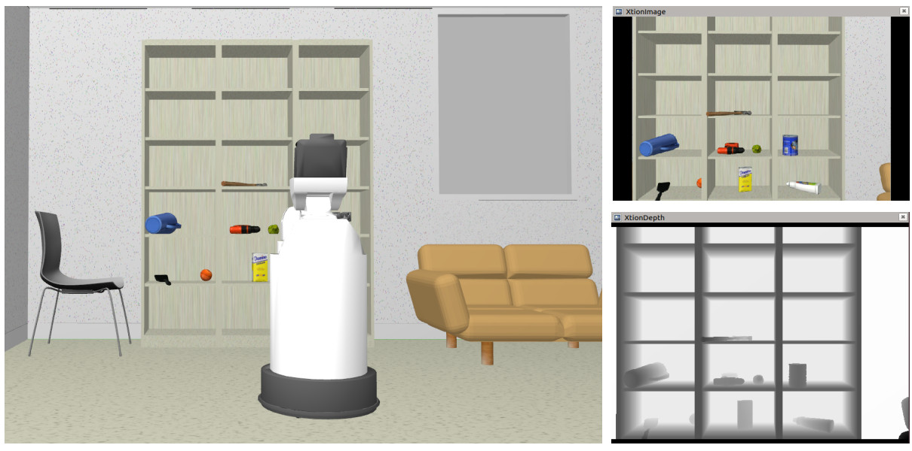
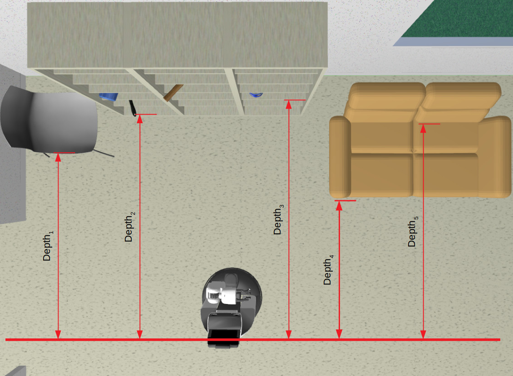
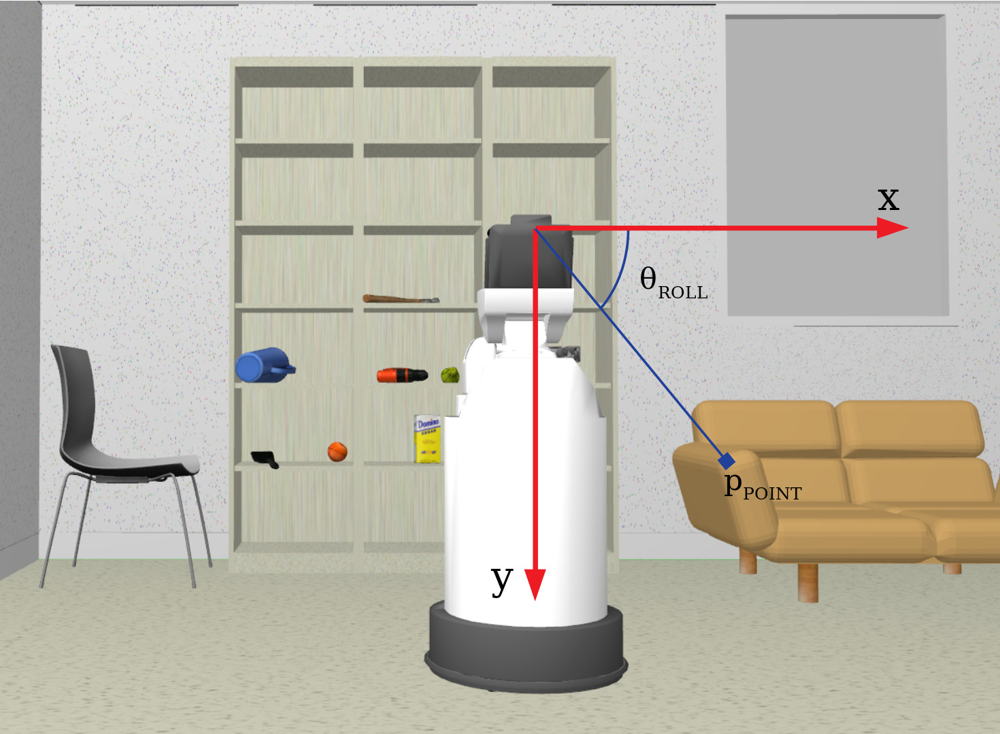
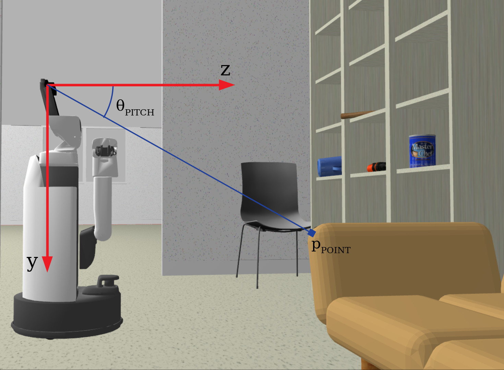
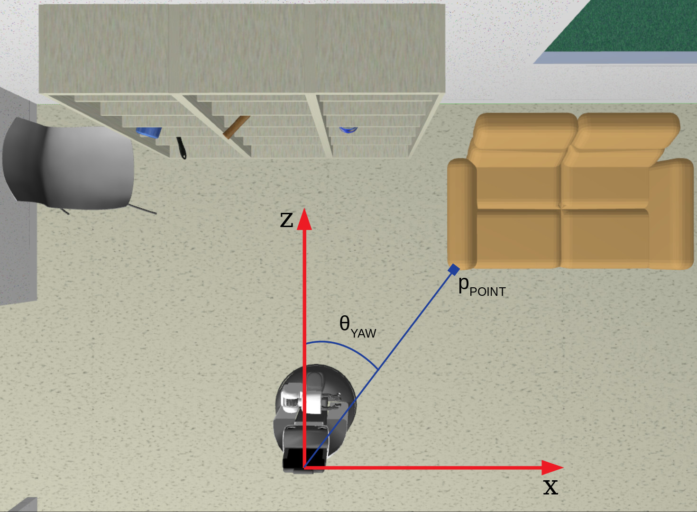
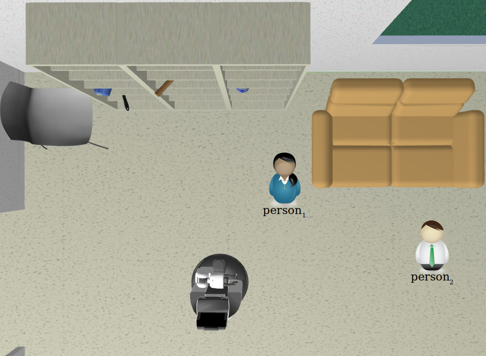
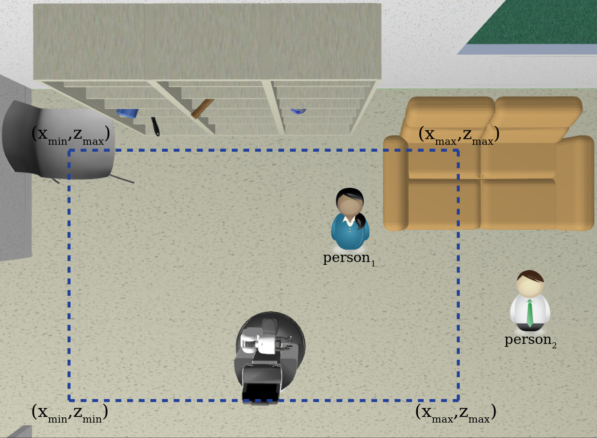
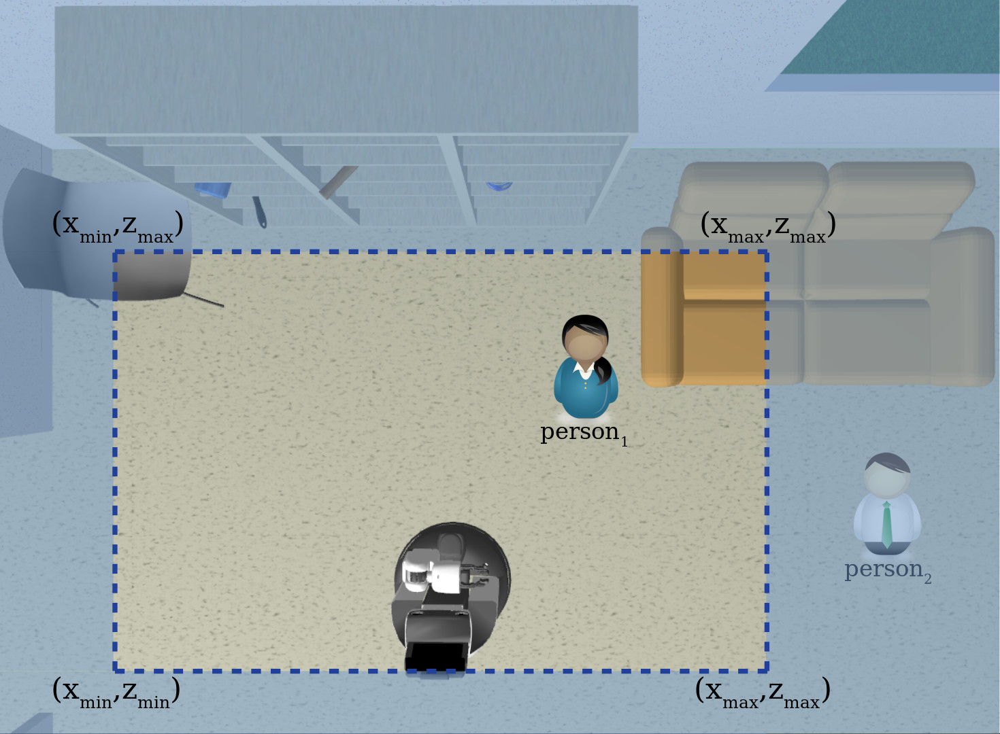
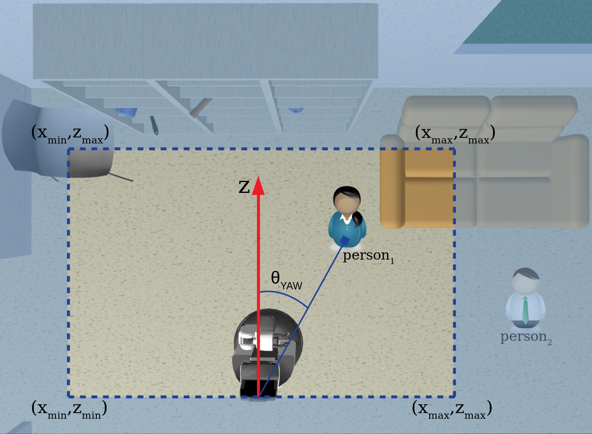

# Point Cloud processing with ROS

We present an introduction to Point Cloud data in ROS and propose a simple task where the students should track a person moving in front of an RGBD camera mounted on a mobile robot.

# 0. Get the robot vision libraries

## 0.1 Clone this repository

**Warning:** *You only need to do this once. If you have already created this repository in your local machine, pulling it again may cause a loss of your information.*

First, create a workspace:

```
cd ~
mkdir -p robovision_ros1_ws/src
cd robovision_ros1_ws
catkin_make
```

Then, clone this repository into the src folder:

```
cd ~/robovision_ros1_ws/src
git clone [https://gitlab.com/trcp/robointro.git](https://github.com/ARTenshi/robovision_ros1.git)
cd ..
catkin_make
```
## 0.2 Extra packages and data

Be sure that you have installed the `ros_numpy` package:

```
sudo apt-get install ros-$release-ros-numpy
```

where `$release` is your ROS version

Also, be sure that you have an RGBD camera or a rosbag containing RGBD data as the one provided in:

> ~/robovision_ros1_ws/src/robovision_ros1/data/rosbags/

# 1. Getting to know your RGBD image

In this lesson, we will apply all that we have learnt in the past two units. First, let's inspect our code in the `rgbd_reader.py` file.

In the main function we can see that, as we have done before, we first initialise our node

```
rospy.init_node('rgbd_reader', anonymous=True)
```

an then we subscribe to the topics we are going to use:

```
rospy.Subscriber("/camera/rgb/image_rect_color", Image , callback_rgb_rect)
rospy.Subscriber("/camera/depth_registered/image", Image, callback_depth_rect)
rospy.Subscriber("/camera/depth_registered/points", PointCloud2, callback_point_cloud)
```

We subscribe to three topics: an **RGB** and **Depth** images and a **Point Cloud** of 3D points, all of them come from the same RGBD sensor

<p align="center">
  
</p>

The RGB image is a color image with three channels (Red, Green, and Blue), and the Depth image corresponds to the metric distance of each pixel of the objects in the image to an orthogonal plane that passes through the center of the camera; you can visualise it as the horizontal distance of a given point to the camera seen from above, regardless of the height, as in the Figure

<p align="center">
  
</p>

We have used an `Image` topic for RGB images before. The Depth image is a matrix of floats corresponding to the metric distance in milimeters. Therefore, in the callback function `callback_depth_rect` we read it as

```
depth_img=bridge_depth.imgmsg_to_cv2(msg,"32FC1").copy()
depth_mat = np.array(depth_img, dtype=np.float32)
```
As the values range from 400 (40 centimeters) to 10000 (10 meters), we normalize it to valid image values and save it in an image array to be able to display it

```
cv2.normalize(depth_mat, depth_img, 0, 1, cv2.NORM_MINMAX)
```

Furthermore, from the RGB and Depth images, for every pixel in the image, we can obtain the metric XYZ position in the space -- we will not go further on this because, luckily, we see that ROS has already calculated it and the `/camera/depth_registered/points` of type `PointCloud2` provides this information. If you type

```
rosmsg info sensor_msgs/PointCloud2
```

in a terminal, you can see the composition of this type of message.

**Important:** the Depth information comes from a structured infrared light sensor and therefore very reflective or transparent surfaces tend to distort the depth information; those points appear as black (zero values) pixels in our depth image. The minimum distance our RGBD sensor is able to read is 40 cm, anything closer to that will be a zero value, as well.

Back to our code, we see that we have a ROS publisher where we want to publish the 3D position of an object in front of our camera; remember that a topic should have a unique name -- in this case, we called it `/object_centroid` and is of the type `Pose`:

```
pub_centroid=rospy.Publisher('/object_centroid', Pose, queue_size=1)
```

A Pose message is a geometry_msgs type that consists of a 3D position in meters and a 4D orientation in quaternion form of every point in the space with respect to the center of the camera:

- object_centroid.position.x
- object_centroid.position.y
- object_centroid.position.z
- object_centroid.orientation.x = quaternion[0]
- object_centroid.orientation.y = quaternion[1]
- object_centroid.orientation.z = quaternion[2]
- object_centroid.orientation.w = quaternion[3]

In the PointCloud2 message, the axes are as follows:

- x: positive from the center of the camera to the right
- y: positive from the center of the camera to the bottom
- z: positive from the center of the camera to the front

With the origin at the center of the camera, the XY axes (front view) and the `ROLL` angle of a point `p` on the plane are:

<p align="center">
  
</p>

the YZ axes (side view) and the `PITCH` angle of a point `p` on the plane are

<p align="center">
  
</p>

and the XZ axes (top view) and the `YAW` angle of a point `p` on the plane are:

<p align="center">
  
</p>


# 2. Point Cloud's manipulation

For ease, we will only provide the code in Python for this unit. The interested reader can program their C++ version.

## 2.1 Single element access

Our subscriber  to the `/camera/depth_registered/points` calls the `callback_point_cloud` function. There, we show how to access a single element. We first read our message `msg` of type `PointCloud2` and convert it to a Python array with the function 

```
pc = ros_numpy.numpify(msg)
```

As we mentioned before, the point cloud contains the 3D position in the space of EACH pixel, and therefore the dimensions of our array are the same as de dimensions of our image

```
rows, cols = pc.shape
print ('point cloud size: rows: {}, cols: {}'.format(rows, cols))
```

We access a single element in our array just as any array in Python `mat[row_id][col_id]`. To access a single dimension X, Y, or Z, we can indicate it directly `mat[row_id][col_id][XYZ]`, where XYZ=0 for the dimension X, XYZ=1 for the dimension Y, and XYZ=2 for the dimension Z. In our example, to access the 3D information in the central point of our image we enter

```
row_id = rows/2 
col_id = cols/2 

p = [pc[row_id][col_id][0], pc[row_id][col_id][1], pc[row_id][col_id][2]]
```
Finally, we store it in our global variable to be published later in the program's main loop by our ROS publisher

```
pub_centroid.publish(object_centroid)
```

Now, let's try our code. We don't need to compile our code in Python. So, run the following command:

```
roscore
```

If you don't have an RGBD camera, don't worry, we provide you with a ROS bag with some data collected using an XTion Pro mounted at the top of a Turtlebot 2, at a height 1.0 meter from the floor. In a different terminal, run:


```
rosbag play -l ~/robovision_ros1_ws/src/robovision_ros1/data/rosbags/person_static.bag
```

Then, in a different terminal enter

```
rostopic list
```

Can you see all the different topics you can work with!?

Now enter

```
source ~/robovision_ros1_ws/devel/setup.bash
rosrun introvision_rgbd rgbd_reader.py
```

Can you see the 3D information of our middle point in the image?

Finally, in a new terminal:

```
rostopic echo /object_centroid
```

You should be able to see the same information being published in our ROS topic!

### Homework 2.1

* Provide the 3D position of five different points in our image (enter different row_id, and col_id). Can you see how the X, Y, and Z values change with respect to the central point? X is positive to the right of our middle point and Y is positive below the middle point.

* What's the 3D information for point (row_id=0, col_id=0)? Please note that, when the information is not available for a given point due to the structured light reflection properties, the system returns 'nan' values. In Python you can check if a variable is `nan` with the `math.isnan(x)` function in the `math` library -- this function returns a `True` or `False` value. You can validate your data using the `if ( not math.isnan(pc[row_id][col_id][0]) ):` structure, for example.

# 3. Final project

Now you have all the tools to program a nice robot vision project.

The problem is this: We have a robot facing towards a moving person and **we want to find the relative position of this person to the center of the robot (represented here as the camera position).** 

In other words, we want to find the 3D position of person_1

<p align="center">
  
</p>

How can you do it?

You can use the `person_static.bag` and the `person_dynamic.bag` ROS bags in the `~/robovision_ros1_ws/src/robovision_ros1/data/rosbags/` folder if you don't have an RGBD camera.

**Hint** Remember that the Point Cloud returns all the 3D information of all points visible by the camera, so why not limit it? You can create a valid zone where you can track your person better without any extra information

<p align="center">
  
</p>

You can use a structure where you compare if every image 3D point is inside this box (first check if your point is not `nan`)

<p align="center">
  
</p>

Don't forget to use the appropriate signs, especially in the Y-axis, if the camera is 1.0 meter above the floor, what condition should any point different than the floor meet? Again, pay special attention to the Y-axis direction.

**Hint** Remember the `ROLL`, `PITCH` and `YAW` definitions

<p align="center">
  
</p>

You can convert those values to quaternion form by using the Python function

```
quaternion = tf.transformations.quaternion_from_euler(roll, pitch, yaw)
```

and then store it in our variable

```
object_centroid.orientation.x = quaternion[0]
object_centroid.orientation.y = quaternion[1]
object_centroid.orientation.z = quaternion[2]
object_centroid.orientation.w = quaternion[3]
```

Good luck!

### Challenge 3.1

How can you improve the performance? **Important: Remember that each 2D image point has its corresponding 3D point in the Point Cloud, you can use this information!** Maybe you can try detecting the person's face first and then take the 3D points average inside that region. OpenCV provides a series of functions that might help you with that, e.g.

> https://docs.opencv.org/3.4/db/d28/tutorial_cascade_classifier.html 

What about detecting the whole person's body and getting the 3D points average inside the person's bounding box? In the example above, you can add an extra classifier of the form:

> bodydetection = cv2.CascadeClassifier('cascades/haarcascade_fullbody.xml')

Would you accept the challenge?

## Authors

* **Luis Contreras** - [ARTenshi](https://artenshi.github.io/)
* **Hiroyuki Okada** - [AIBot](http://aibot.jp/)
